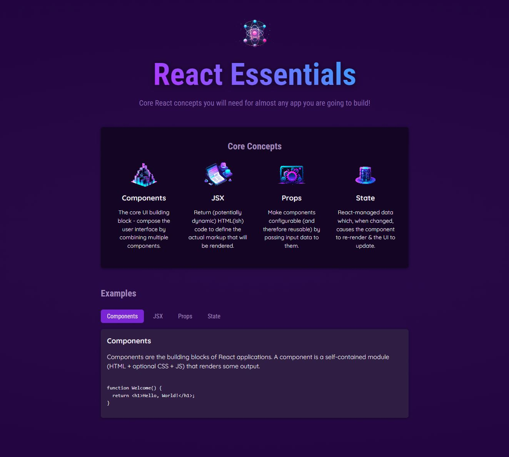

# React Essentials

## Table of contents
* [General info](#general-info)
* [Description](#description)
* [Screenhot](#screenhot)
* [Technolgies](#technolgies)
* [Setup & Start](#setup)
* [Deploy](#deploy)
* [Created](#created)
* [License](#license)

## General info 

A web application, built with React according to "React - The Complete Guide 2023 (incl. React Router & Redux)course"

## Description 

Dive in and learn React.js from scratch! Learn React, Hooks, Redux, React Router, Next.js, Best Practices and way more! [React - The Complete Guide 2023 (incl. React Router & Redux)](https://www.udemy.com/course/react-the-complete-guide-incl-redux/)

## Screenhot 

## Technolgies 

* React - Front End Library
* Node.js
* Vite.js

## Setup & Start 

* Clone or download the repo
* Open the directory and run `npm install` in the project root.
* Run `npm run dev` in the project root and the app will be available on port in localhost.

## Deploy 

* You can start by installing surge globally. **npm install --global surge**.
* `npm run build`
* Select the build folder and check it
* [Check the documentation](https://surge.sh/)

Deployed on reactessentials-ivor.surge.sh](https://reactessentials-ivor.surge.sh)

## Created 

2024

## License 